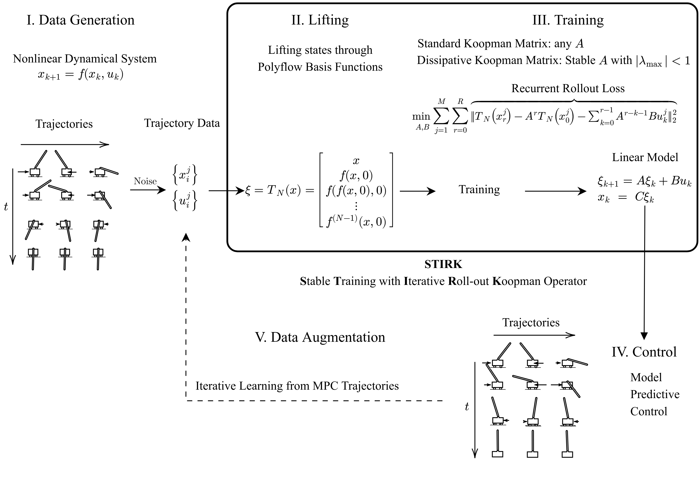

## Reference
- [Learning Noise-Robust Stable Koopman Operator for Control with Physics-Informed Observables](https://www.arxiv.org/pdf/2408.06607)


## Requires
1. Windows 7 or greater or Linux.
2. Python 3.8.
3. The installation path must be in English.


## Installation
```bash
# Please make sure not to include Chinese characters in the installation path, as it may result in a failed execution.
# clone DSAC-T repository
git clone git@github.com/orgs/csml-rpi/stirk
cd stirk
# create conda environment
conda env create -f dmpc.yml
conda activate dmpc
# install dmpc
pip install -e.
```

## Description



<!-- 
## Train
These are two examples of running DSAC-T on two environments. 
Train the policy by running:
```bash
cd example_train
#Train a pendulum task
python main.py
#Train a humanoid task. To execute this file, Mujoco and Mujoco-py need to be installed first. 
python dsac_mlp_humanoidconti_offserial.py
```
After training, the results will be stored in the "DSAC-T/results" folder.

### Algorithm Switching
In the "main.py/dsac_mlp_humanoidconti_offserial.py" file, you can switch between 'DSAC_V2' and 'DSAC_V1' by changing the "--algorithm" parameter. 

## Simulation 
In the "DSAC-T/results" folder, pick the path to the folder where the policy will be applied to the simulation and select the appropriate PKL file for the simulation.
```bash
python run_policy.py
#you may need to "pip install imageio-ffmpeg" before running this file on Windows. 
```
After running, the simulation vedio and state&action curve figures will be stored in the "DSAC-T/figures" folder.


## Acknowledgment
We would like to thank all members in Intelligent Driving Laboratory (iDLab), School of Vehicle and Mobility, Tsinghua University for making excellent contributions and providing helpful advices for DSAC-T. -->